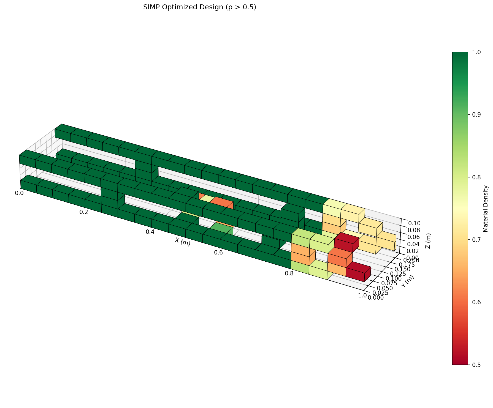
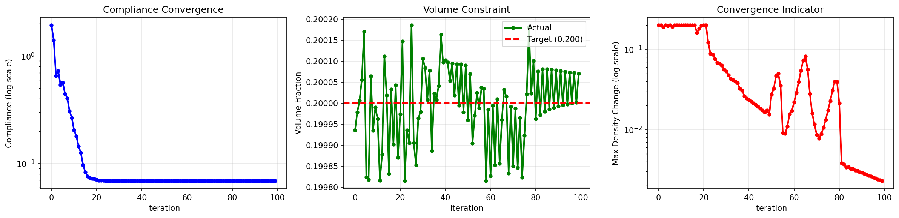
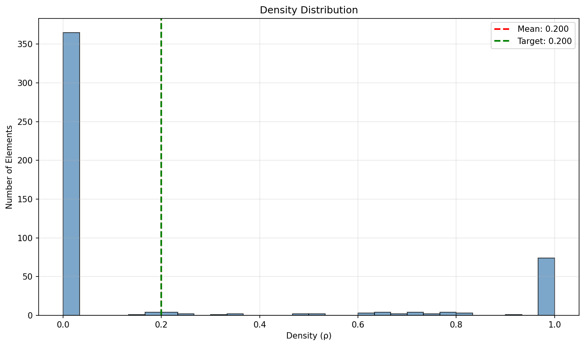

# HACK3D — SIMP Topology Optimizer
### 3D Structural Optimization · Digital Manufacturing Security · NYU VIP


---

A full-stack web application for **3D topology optimization** using the SIMP (Solid Isotropic Material with Penalization) method — built for the NYU VIP Hack3D Digital Manufacturing Cybersecurity project.

Users can define boundary conditions, apply loads, and generate structurally optimized 3D geometries directly in the browser — no coding required. The app also features a **Watermark Lab** for embedding and testing digital signatures in density fields, connecting to the team's broader cybersecurity research.

---

## What it looks like

| Optimizer | Watermark Lab |
|-----------|---------------|
|  | Configure boundary conditions, run SIMP, analyze results |

**Sample outputs after optimization:**

| Convergence History | Density Distribution |
|---|---|
|  |  |

---

## Features

- **Interactive 3D topology optimizer** — configure mesh resolution, volume fraction, SIMP penalty, and iteration count
- **Live streaming iteration feed** — watch compliance and volume update in real time as the optimizer runs
- **Visual boundary condition diagram** — isometric 3D preview updates live as you change fixed/load faces
- **4 quick presets** — Cantilever, Bridge, Column, Quick Test — auto-fill all parameters in one click
- **Hover tooltips** — plain-English explanations for every engineering parameter
- **Export button** — download any result image (structure, convergence, histogram) directly from the UI
- **Watermark Lab** — embed spread-spectrum watermarks into density fields, verify them, and simulate adversarial attacks (Gaussian noise, scaling, zeroing, quantization, smoothing)

---

## Project structure

```
Hack3D-SIMP-Topology-Optimization/
│
├── app.py                        # Flask backend — REST + SSE streaming API
├── fem3d_numpy.py                # Hexahedral FEM solver (pure NumPy)
├── simp_numpy.py                 # SIMP optimizer core
├── run_optimization_numpy.py     # Standalone CLI runner (no web UI needed)
├── watermark.py                  # Spread-spectrum watermarking module
│
├── frontend/
│   └── src/
│       ├── App.js                # Main React app (optimizer + watermark lab)
│       └── App.css               # Dark cyberpunk UI styling
│
├── .gitignore
└── README.md
```

---

## Getting started

### Prerequisites
- Python 3.9+
- Node.js 18+

### 1. Clone the repo
```bash
git clone https://github.com/codestdoufu/Hack3D-SIMP-Topology-Optimization.git
cd Hack3D-SIMP-Topology-Optimization
```

### 2. Install Python dependencies
```bash
pip install flask flask-cors numpy matplotlib
```

### 3. Start the Flask backend
```bash
python app.py
```
Backend runs at `http://127.0.0.1:5000`. Verify it's alive at `/health`.

### 4. Start the React frontend
```bash
cd frontend
npm install
npm start
```
App opens at `http://localhost:3000`.

### 5. Run a quick test
In the sidebar, click the **⚡ Quick Test** preset and hit **RUN OPTIMIZATION**. You'll see the live iteration feed and a 3D result in about 15 seconds.

---

## How the optimizer works

The core algorithm is **SIMP (Solid Isotropic Material with Penalization)**:

1. A 3D hexahedral mesh is created over the design domain
2. Each element is assigned a density value ρ ∈ [0, 1]
3. The FEM solver computes structural compliance (how much the structure deforms under load)
4. Sensitivities are computed and densities are updated to minimize compliance while respecting the volume constraint
5. A density filter smooths the field to prevent checkerboarding
6. This repeats for N iterations until convergence

The penalization (p = 3 by default) pushes densities toward 0 or 1, producing a clean solid/void design.

---

## API endpoints

| Method | Endpoint | Description |
|--------|----------|-------------|
| `GET`  | `/health` | Health check |
| `POST` | `/optimize/stream` | Run optimization — returns Server-Sent Events stream |
| `POST` | `/watermark/embed` | Embed watermark into density field |
| `POST` | `/watermark/detect` | Detect and decode watermark |
| `POST` | `/watermark/attack` | Simulate adversarial attack on watermarked density |

---

## Watermark module

`watermark.py` implements **spread-spectrum digital watermarking** for FEM density fields:

- **Embed** — a binary message is spread over a pseudo-random carrier sequence and added to the density field at amplitude α
- **Detect** — the carrier is correlated against the recovered perturbation to decode the message
- **Attack simulation** — tests robustness against noise, scaling, zeroing, quantization, and smoothing

This connects to the Hack3D team's broader research on protecting CAD/manufacturing data from cyber threats.

---

## Built with

- [NumPy](https://numpy.org/) — FEM solver and SIMP optimizer (no PyTorch required)
- [Matplotlib](https://matplotlib.org/) — 3D visualization and convergence plots
- [Flask](https://flask.palletsprojects.com/) — Python backend with SSE streaming
- [React](https://react.dev/) — Frontend UI
- [Barlow / Share Tech Mono](https://fonts.google.com/) — Typography

---

## Team

Built by **David Fu** as part of the **NYU VIP Hack3D** team.

- Faculty Advisor: Prof. Nikhil Gupta (ngupta@nyu.edu)
- NYU Composite Materials and Mechanics Lab
- NYU Center for Cybersecurity
- Supported by the National Science Foundation

---

## License

For academic and research use within the NYU VIP program.
